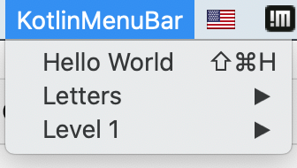
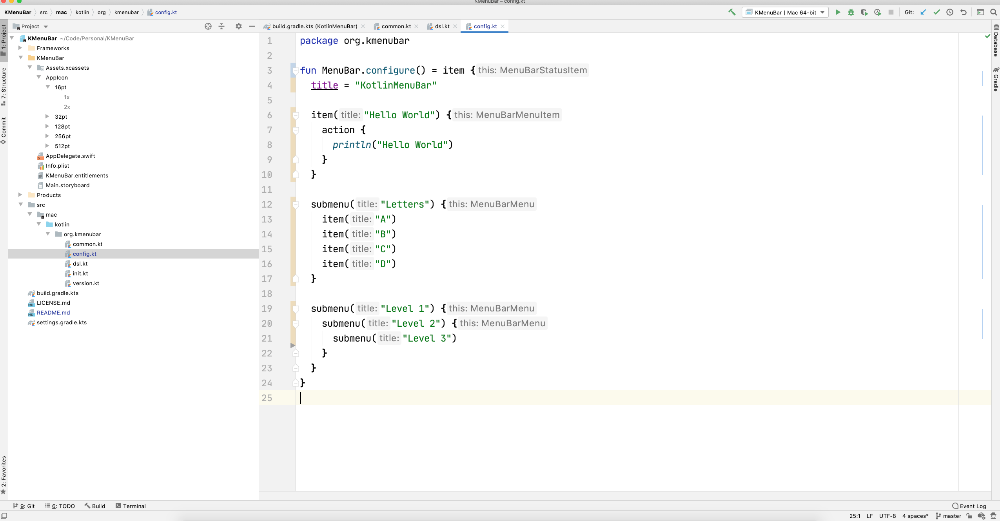

# KMenuBar

Kotlin macOS Menu Bar Application



## Usage

### Requirements

- macOS
- AppCode or Xcode

AppCode IDE will give you the best experience,
as you can edit Kotlin and Swift code in the same IDE.
When using AppCode, install the Kotlin/Native for AppCode plugin to get built-in Kotlin support.

If you use Xcode, the Kotlin files will appear without syntax highlighting. The recommended way to edit
when using Xcode is to use IntelliJ IDEA for Kotlin and Xcode for running the application.



## Example Usage

This is an example of a Menu Bar application created with the Kotlin DSL.
This code is available at `src/mac/kotlin/org/kmenubar/config.kt` in this repository.

```kotlin
fun MenuBar.configure() = item {
  title = "KotlinMenuBar"

  item("Hello World") {
    action {
      println("Hello World")
    }
  }

  submenu("Letters") {
    item("A")
    item("B")
    item("C")
    item("D")
  }

  submenu("Level 1") {
    submenu("Level 2") {
      submenu("Level 3")
    }
  }
}
```
